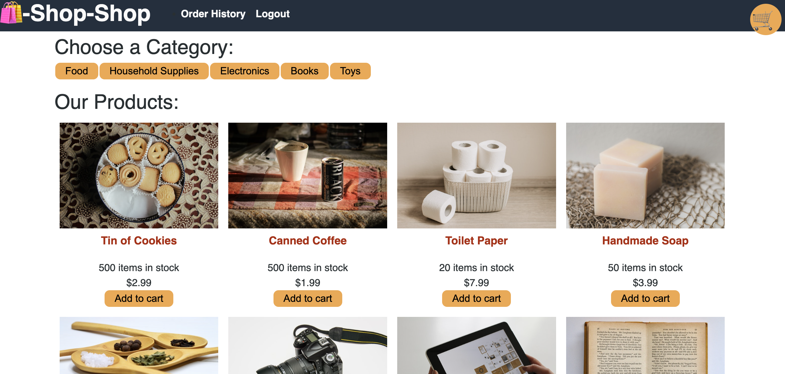

# Shop Shop

## Table of Contents

- [Description](#description)
- [Education](#education)
- [Application](#application)
- [Questions](#questions)

## Description

In this MERN application, we centralized all of the application's data in state globally to make it easier to share state across the entire application, and created a shopping cart for the application, added offline functionality with IndexedDB, and processed secure online payments with Stripe using Redux methodologies with React Context API following the steps of a course module.

## Education

In this course module we:

- Generated product, price, and checkout session IDs by using the Stripe API.
- Captured a completed order by saving IndexedDB data in your MongoDB database.
- Used the useLazyQuery Hook to delay executing a GraphQL query.
- Used the React Context API to implement a Redux-like store.
- Wrote Redux-like actions and reducers with the necessary tests in place.
- Used global state across multiple React components.
- Used IndexedDB within a React component.
- Cached server-side data using IndexedDB.

## Application

[Link to Deployed Application](https://agile-mountain-03189.herokuapp.com/)

## Questions?

For any questions, please email gilinamcbride@gmail.com, or visit any other projects on [Github](github.com/gilinamcbride).
